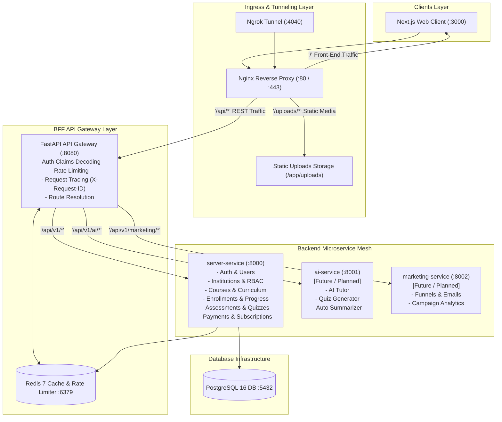

# 🚀 LearnioX — Project Overview, Current Status & Future Roadmap

---

## 1. 🎯 Purpose & Core Vision of LearnioX

**LearnioX** is a **Multi-Tenant Ed-Tech Operating System** — combining the best elements of **YouTube (Frictionless Discovery) + Udemy (Course Marketplace) + Graphy/Teachmint (Institution Creator Suite) + Patreon (Tiered Memberships) + AI Automation**.

### 🌟 The Core Motto
> *"A single educator or creator should be able to run an entire online coaching institution autonomously with the power of AI, automation, and integrated business tools."*

### 🔑 Key Objectives
1. **Dual-Sided Ecosystem**:
   - **Learner Experience**: Frictionless discovery without mandatory login, free preview lessons, consolidated multi-institution dashboard, note-taking, interactive quizzes, doubts, assignments, and verified certificates.
   - **Institution / Creator Studio**: Every coaching institute gets its own branded mini-platform/portal (`/c/[institutionSlug]`), team role-based access control (RBAC), curriculum authoring, media library, student management, monetization models, and analytics.
2. **Unified Marketplace + Multi-Tenancy**:
   - Instead of isolated silos, all institutions share a global marketplace and search engine, but operate with complete tenant isolation and custom branding.

---

## 2. 🏗️ High-Level System Architecture

The project is structured as a **Microservice & Gateway Topology** driven by Docker:

---

## 3. 🔍 Deep Analysis: Current Implementation Status

Here is what is **currently implemented and fully functional** in the codebase:

### 3.1 Infrastructure & Gateway
* [docker-compose.yml](file:///c:/Users/ashut/Devlopments/Ovanthra/LearnioX/docker-compose.yml): Configures 7 production-aligned containers:
  * `learniox-postgres` (PostgreSQL 16)
  * `learniox-redis` (Redis 7 for rate-limiting & caching)
  * `learniox-server-service` (Main Python FastAPI microservice)
  * `learniox-api-gateway` (FastAPI BFF gateway)
  * `learniox-nginx-ingress` (Nginx reverse proxy for SSL, static routing, and sub-millisecond API proxying)
  * `learniox-client-service` (Next.js 14 App Router)
  * `learniox-ngrok` (Public HTTPS tunneling for webhooks and mobile testing)
* **BFF API Gateway** ([apps/api-gateway](file:///c:/Users/ashut/Devlopments/Ovanthra/LearnioX/apps/api-gateway)):
  * `RequestIdMiddleware`: Generates and propagates `X-Request-ID`.
  * `GatewayAuthClaimsMiddleware`: Decodes JWT tokens at the edge and forwards claims (`X-User-ID`, `X-User-Email`).
  * Dynamic routing registry via [routes.py](file:///c:/Users/ashut/Devlopments/Ovanthra/LearnioX/apps/api-gateway/app/registry/routes.py).

---

### 3.2 Backend Service (`apps/server-service`)
Built on **FastAPI + SQLAlchemy 2.0 (Async) + Pydantic v2**, following a **5-layer architectural pattern** (*Router → Service → Repository → Model → PostgreSQL*):

#### **Domain Models & Tables Implemented** ([apps/server-service/app/models](file:///c:/Users/ashut/Devlopments/Ovanthra/LearnioX/apps/server-service/app/models)):
1. **Authentication & Users**:
   * [User](file:///c:/Users/ashut/Devlopments/Ovanthra/LearnioX/apps/server-service/app/models/user.py), [RefreshToken](file:///c:/Users/ashut/Devlopments/Ovanthra/LearnioX/apps/server-service/app/models/refresh_token.py), Google OAuth2 integration, JWT authentication.
2. **File & Media Storage**:
   * [FileRecord](file:///c:/Users/ashut/Devlopments/Ovanthra/LearnioX/apps/server-service/app/models/file.py), [FolderRecord](file:///c:/Users/ashut/Devlopments/Ovanthra/LearnioX/apps/server-service/app/models/folder.py) for chunked & local multi-tenant uploads.
3. **Multi-Tenant Institutions & RBAC**:
   * [Institution](file:///c:/Users/ashut/Devlopments/Ovanthra/LearnioX/apps/server-service/app/models/institution.py), [InstitutionSettings](file:///c:/Users/ashut/Devlopments/Ovanthra/LearnioX/apps/server-service/app/models/institution.py), [InstitutionMember](file:///c:/Users/ashut/Devlopments/Ovanthra/LearnioX/apps/server-service/app/models/member.py), [InstitutionInvite](file:///c:/Users/ashut/Devlopments/Ovanthra/LearnioX/apps/server-service/app/models/member.py).
   * Granular permissions engine: [Role](file:///c:/Users/ashut/Devlopments/Ovanthra/LearnioX/apps/server-service/app/models/role.py), [Permission](file:///c:/Users/ashut/Devlopments/Ovanthra/LearnioX/apps/server-service/app/models/role.py), custom RBAC mapping.
4. **Courses & Curriculum**:
   * [Course](file:///c:/Users/ashut/Devlopments/Ovanthra/LearnioX/apps/server-service/app/models/course.py), [CourseCategory](file:///c:/Users/ashut/Devlopments/Ovanthra/LearnioX/apps/server-service/app/models/course.py), [CourseTag](file:///c:/Users/ashut/Devlopments/Ovanthra/LearnioX/apps/server-service/app/models/course.py).
   * Hierarchical curriculum: [CourseModule](file:///c:/Users/ashut/Devlopments/Ovanthra/LearnioX/apps/server-service/app/models/curriculum.py), [Lesson](file:///c:/Users/ashut/Devlopments/Ovanthra/LearnioX/apps/server-service/app/models/curriculum.py), [LessonContent](file:///c:/Users/ashut/Devlopments/Ovanthra/LearnioX/apps/server-service/app/models/curriculum.py), [LessonResource](file:///c:/Users/ashut/Devlopments/Ovanthra/LearnioX/apps/server-service/app/models/curriculum.py).
5. **Enrollment & Learning Tracking**:
   * [Enrollment](file:///c:/Users/ashut/Devlopments/Ovanthra/LearnioX/apps/server-service/app/models/enrollment.py), [LessonProgress](file:///c:/Users/ashut/Devlopments/Ovanthra/LearnioX/apps/server-service/app/models/enrollment.py), [CourseProgress](file:///c:/Users/ashut/Devlopments/Ovanthra/LearnioX/apps/server-service/app/models/enrollment.py), [LessonBookmark](file:///c:/Users/ashut/Devlopments/Ovanthra/LearnioX/apps/server-service/app/models/enrollment.py).
6. **Assessments & Evaluation**:
   * [Quiz](file:///c:/Users/ashut/Devlopments/Ovanthra/LearnioX/apps/server-service/app/models/assessment.py), [QuizQuestion](file:///c:/Users/ashut/Devlopments/Ovanthra/LearnioX/apps/server-service/app/models/assessment.py), [QuizOption](file:///c:/Users/ashut/Devlopments/Ovanthra/LearnioX/apps/server-service/app/models/assessment.py), [QuizAttempt](file:///c:/Users/ashut/Devlopments/Ovanthra/LearnioX/apps/server-service/app/models/assessment.py), [QuizAnswer](file:///c:/Users/ashut/Devlopments/Ovanthra/LearnioX/apps/server-service/app/models/assessment.py).
   * [Assignment](file:///c:/Users/ashut/Devlopments/Ovanthra/LearnioX/apps/server-service/app/models/assessment.py), [AssignmentSubmission](file:///c:/Users/ashut/Devlopments/Ovanthra/LearnioX/apps/server-service/app/models/assessment.py).
7. **Monetization, Memberships & Payments**:
   * [MembershipPlan](file:///c:/Users/ashut/Devlopments/Ovanthra/LearnioX/apps/server-service/app/models/payment.py), [Subscription](file:///c:/Users/ashut/Devlopments/Ovanthra/LearnioX/apps/server-service/app/models/payment.py), [CoursePurchase](file:///c:/Users/ashut/Devlopments/Ovanthra/LearnioX/apps/server-service/app/models/payment.py), [Payment](file:///c:/Users/ashut/Devlopments/Ovanthra/LearnioX/apps/server-service/app/models/payment.py), [Coupon](file:///c:/Users/ashut/Devlopments/Ovanthra/LearnioX/apps/server-service/app/models/payment.py).

#### **API Endpoints (30+ Modules)**:
All registered under `/api/v1/*` in [router.py](file:///c:/Users/ashut/Devlopments/Ovanthra/LearnioX/apps/server-service/app/api/v1/router.py) with standardized response wrappers (`{ success, message, data, error }`).

---

### 3.3 Frontend Client (`apps/client-service`)
Built on **Next.js 14 App Router + TypeScript + Tailwind CSS + Shadcn UI**:
* **State Management**: Redux Toolkit ([store.ts](file:///c:/Users/ashut/Devlopments/Ovanthra/LearnioX/apps/client-service/src/store/store.ts), `authSlice`, `institutionSlice`).
* **Data Fetching**: TanStack React Query v5.
* **HTTP Client**: Centralized Axios ([api.ts](file:///c:/Users/ashut/Devlopments/Ovanthra/LearnioX/apps/client-service/src/lib/api.ts)) with automatic Bearer token injection, automatic 401 token refresh queue, and envelope unwrapping.
* **Implemented Pages & Routes**:
  * `/` — Landing page with course discovery and system feature grid.
  * `/auth/login` & `/auth/callback/[provider]` — Google OAuth2 callback handler.
  * `/dashboard` — Learner dashboard with real-time enrolled course metrics.
  * `/courses` & `/courses/[id]` — Course catalog and course detail/syllabus view.
  * `/institution` & `/institution/[id]` — Institution public landing page.

---

## 4. 📊 Implementation Matrix: What's Built vs What's Next

| Domain / Area | Backend Status | Frontend Status | Overall Readiness |
| :--- | :--- | :--- | :--- |
| **Auth & OAuth2 (Google/JWT)** | ✅ Complete | ✅ Complete (`/auth/callback`, `/login`) | 🟢 **100%** |
| **Institution Multi-Tenancy & RBAC** | ✅ Complete | 🟡 Partial (Landing Page built, Studio builder pending) | 🟡 **70%** |
| **Course & Curriculum Management** | ✅ Complete | 🟡 Partial (Catalog & Detail pages built) | 🟡 **70%** |
| **Assessments (Quizzes & Assignments)** | ✅ Complete | ⚪ UI Mockups planned | 🟠 **50%** |
| **Enrollment & Learning Tracking** | ✅ Complete | 🟡 Partial (Dashboard tracking active) | 🟡 **65%** |
| **Payments, Subscriptions & Coupons** | ✅ Complete | ⚪ Checkout UI & Webhooks integration pending | 🟠 **45%** |
| **Media & File Storage (Local/Volumes)**| ✅ Complete | 🟡 Upload integration partially wired | 🟡 **60%** |
| **BFF API Gateway & Routing** | ✅ Complete | ✅ Configured | 🟢 **100%** |
| **AI Tutor & Copilot Service** | ⚪ Scaffolding ready | ⚪ Pending | ⚪ **10%** |
| **Marketing Service (Emails/Funnels)** | ⚪ Scaffolding ready | ⚪ Pending | ⚪ **10%** |

---

## 5. 🔮 Future Goals & Roadmap

### 🏁 Phase 1: Complete the Core Web Experience (Immediate Next Step)
1. **Academy Studio (Creator Dashboard)**:
   * Build the drag-and-drop course curriculum builder (`/studio/courses/[id]/curriculum`).
   * Video upload and chunked processing UI.
   * Doubts answering queue for instructors (`/studio/doubts`).
2. **Learner Learning Experience**:
   * Interactive video player with bookmarking and side-by-side note-taking (`/learn/watch/[lessonId]`).
   * Quiz taking interface with automated score computation (`/learn/quiz/[quizId]`).
   * Assignment submission & grading feedback view.
3. **Checkout & Payment Integration**:
   * Stripe / Razorpay checkout dialog and webhook verification.

---

### 🚀 Phase 2: AI Copilot & Intelligence Service (`ai-service`)
1. **AI Course Generation**: Auto-generate syllabi, module outlines, and reading materials from topic keywords.
2. **AI Quiz & Flashcard Generator**: Automatically ingest lesson video transcripts or PDFs and generate MCQ assessments.
3. **AI Doubt Resolver**: 24/7 student doubt-solving bot trained on course transcripts and lecture notes.
4. **Content Intelligence**: Automated video transcription, caption generation, and chapter timestamping.

---

### 📈 Phase 3: Marketing & Growth Engine (`marketing-service`)
1. **Landing Page Builder**: Allow institutions to build custom landing pages for their courses without writing code.
2. **Lead Generation & Drip Sequences**: Automated email sequences for abandoned checkouts and student re-engagement.
3. **Affiliate & Referral Programs**: Custom referral codes and commission tracking for students and partner influencers.

---

### ☁️ Phase 4: Production Scale & Cloud Infrastructure
1. **Video Streaming Pipeline**: Transition from local file storage to **AWS S3 / Cloudflare R2 + Cloudflare Stream / HLS video transcoding**.
2. **Custom Domains**: Support white-label custom domains for institutions (e.g., `academy.myinstitute.com`).
3. **Real-time Live Classes**: WebRTC / Zoom SDK integration for scheduled live interactive batches.
4. **Mobile Applications**: React Native / Flutter mobile app for offline lesson downloads.