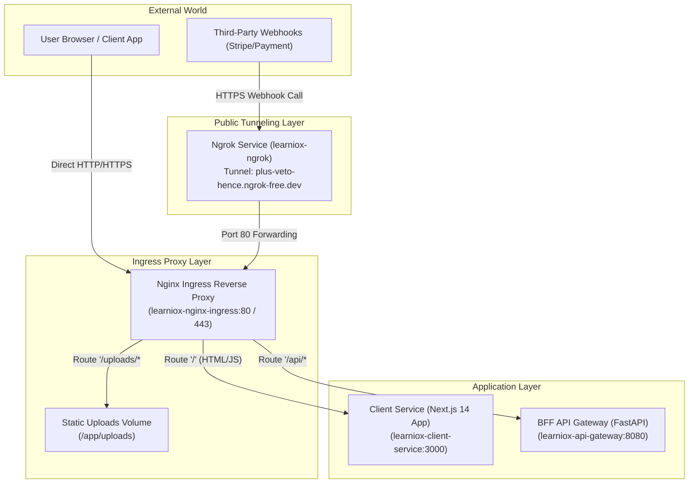
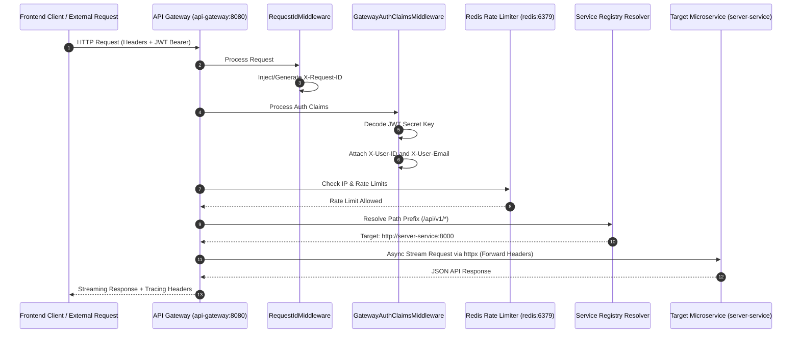
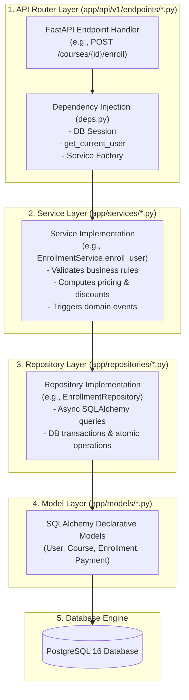
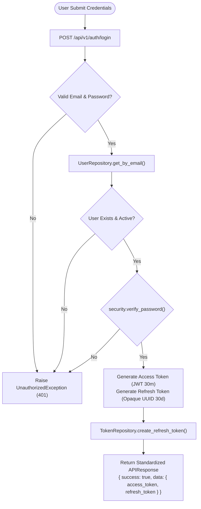
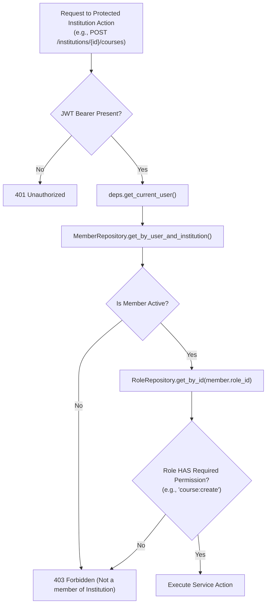
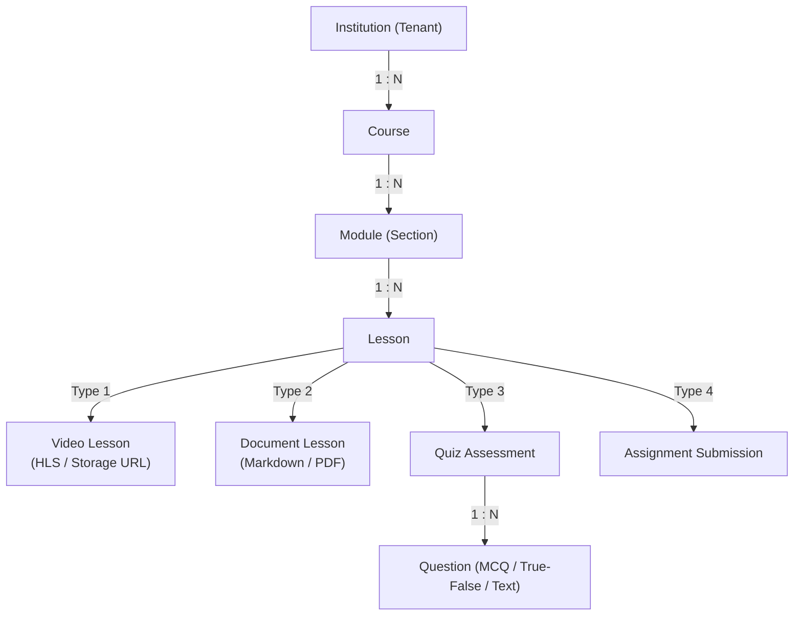
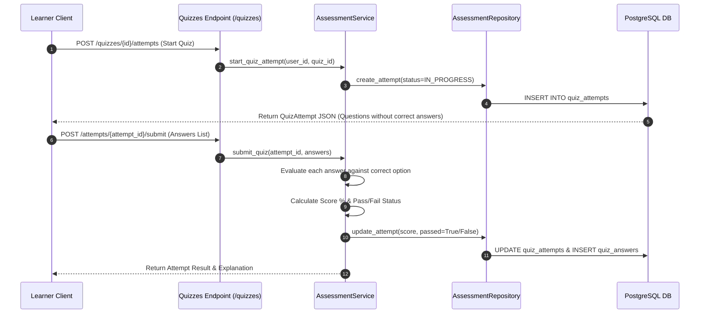
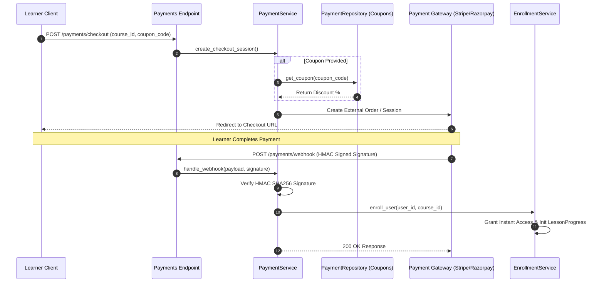
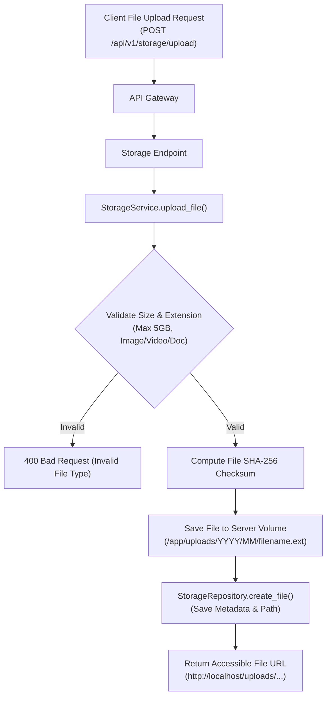
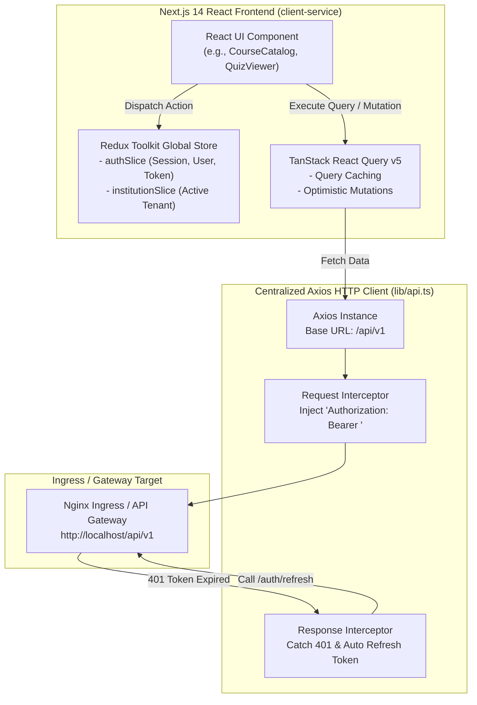

# LearnioX Project Architecture & System Flowcharts

This document provides a complete technical visualization of the LearnioX platform using Mermaid architecture diagrams and flowcharts.

---

## 1. System Ingress & Public Tunneling Topology



---

## 2. BFF API Gateway Request Lifecycle



---

## 3. Core Service Routing & Microservice Mesh

```mermaid
flowchart LR
    subgraph Gateway["BFF API Gateway (:8080)"]
        RouterRegistry["SERVICE_REGISTRY\nPath Matching Engine"]
    end

    subgraph Microservices["Backend Microservices"]
        ServerService["server-service (:8000)\nAuth, Courses, Payments,\nCurriculum, Storage, Users"]
        AIService["ai-service (:8001)\nAI Tutor, Summarizer,\nQuiz Generation"]
        MarketingService["marketing-service (:8002)\nLanding Pages, Emails,\nAnalytics"]
    end

    subgraph DataStore["Data Infrastructure"]
        Postgres[(PostgreSQL 16\nlearniox-postgres:5432)]
        RedisCache[(Redis 7\nlearniox-redis:6379)]
    end

    RouterRegistry -->|Prefix '/api/v1/ai'| AIService
    RouterRegistry -->|Prefix '/api/v1/marketing'| MarketingService
    RouterRegistry -->|Prefix '/api/v1/*' (Default)| ServerService

    ServerService -->|SQLAlchemy 2.0 Async Session| Postgres
    ServerService -->|Cache & Session Storage| RedisCache
    AIService -->|Cache Prompt Context| RedisCache
```

---

## 4. 5-Layer Backend Architecture Flowchart



---

## 5. Domain Specific Flowcharts

### 5.1 Authentication & JWT Token Lifecycle



---

### 5.2 Multi-Tenant Institution RBAC Flowchart



---

### 5.3 Course & Curriculum Builder Structure



---

### 5.4 Quiz Attempt & Automated Grading Engine



---

### 5.5 Payment Checkout & Webhook Instant Access Grant



---

### 5.6 File Storage & Upload Pipeline



---

## 6. Frontend Client State & Data Synchronization (`client-service`)


